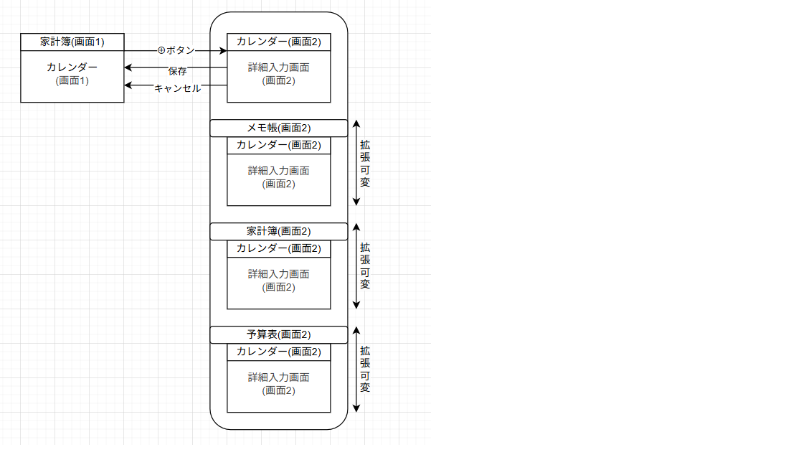
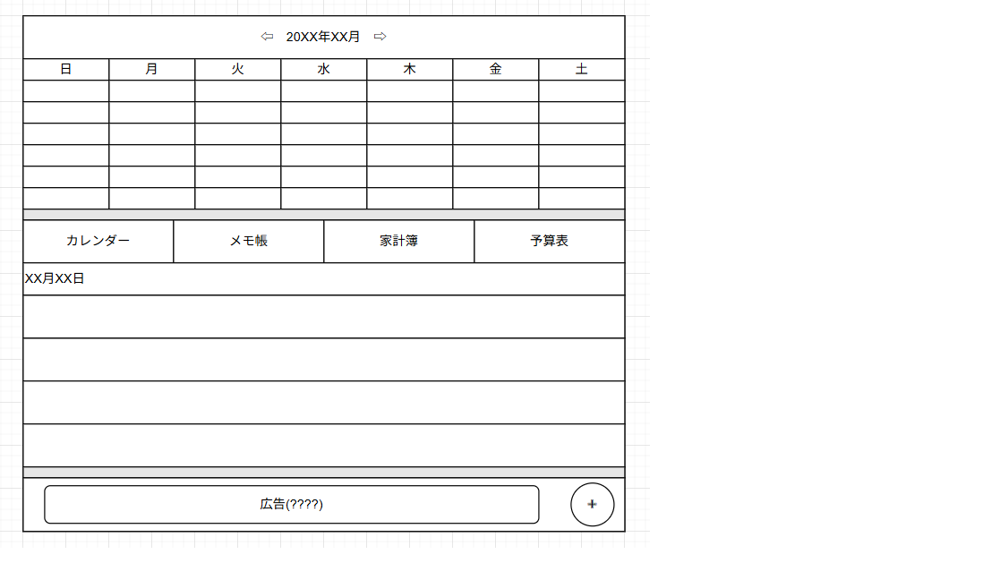
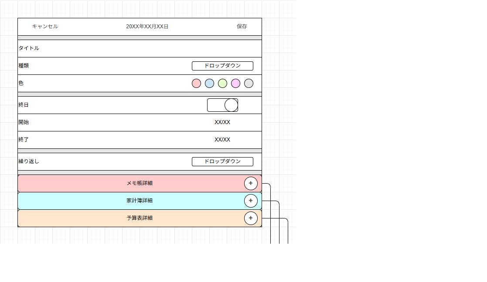
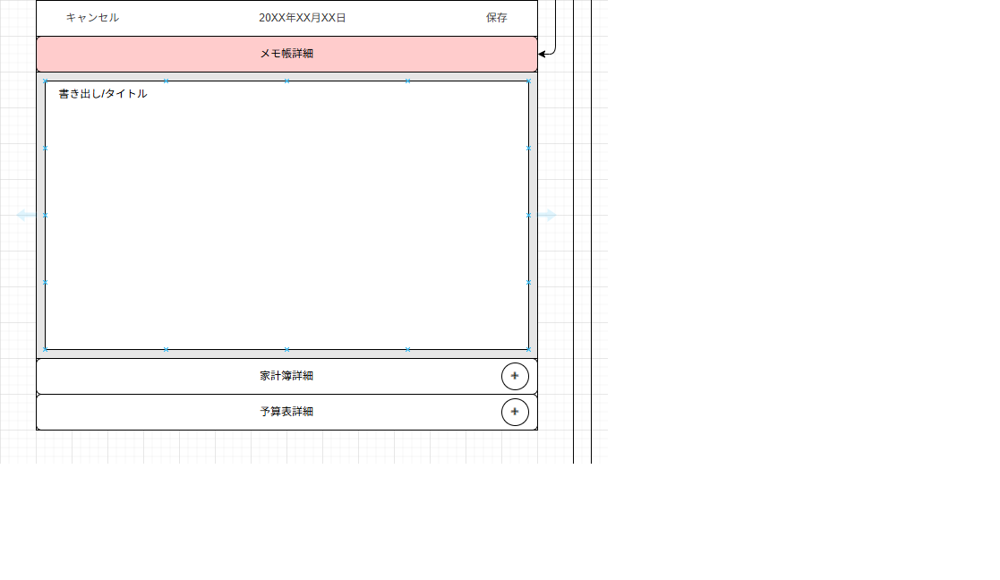
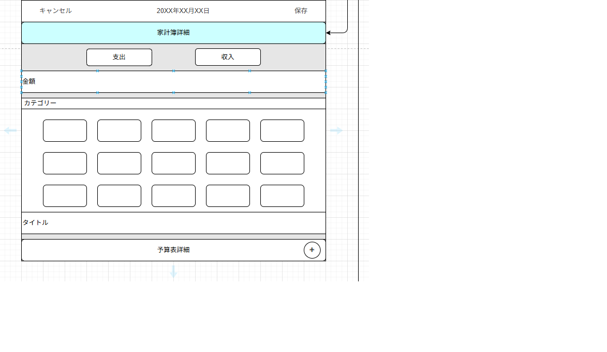
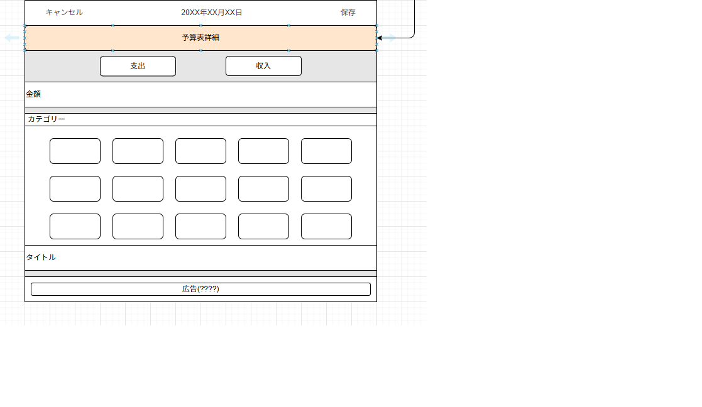
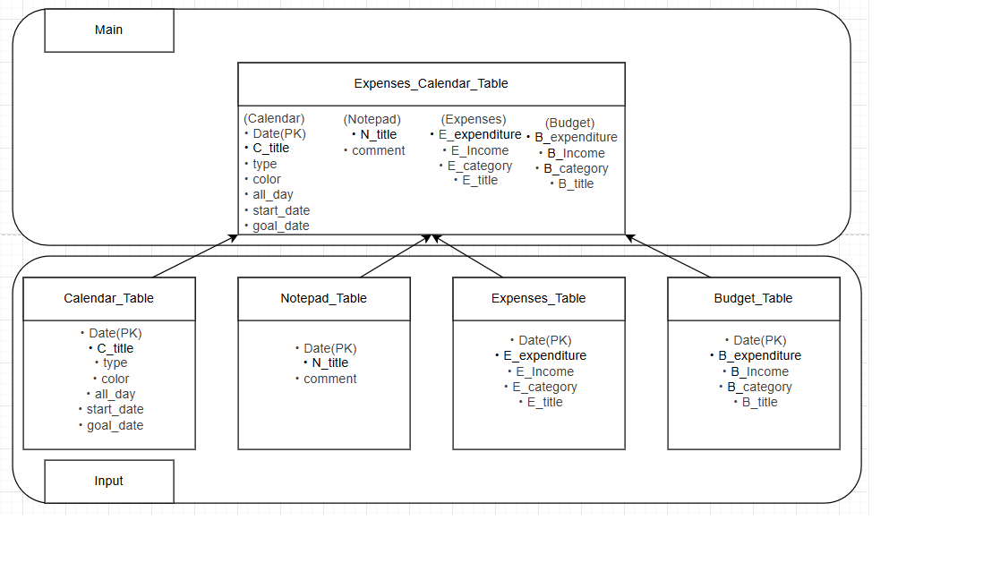

# カレンダー複合機能Webアプリ

## 概要
個人用カレンダーにメモ帳 / 家計簿 / 予算表 と複数の機能を1つにしたアプリケーションです。  
日常的に使っている機能をまとめたアプリを作りたいと思い、訓練で学んだ技術を復習しながら完成させる目的で作成しました。  
  
---
## 開発環境
| 項目 | 内容 |
|------|------|
| 言語 | Java SE (JDK 24) |
| フレームワーク | Servlet / JSP |
| データベース | H2DB |
| ビルドツール | Eclipse |
| アプリケーションサーバー | Apache Tomcat 10_Java21 |
| IDE | Eclipse / VScode |
| バージョン管理 | GitHub |
| OS | Windows |
  
---
  
## 機能一覧
| カテゴリ | 内容 |
|------------|------|
| データ管理 | データベース・一覧表示 |
| データ登録 | フォーム入力によるデータ追加・バリデーション処理 |
| 更新／削除 | 登録データの編集・削除機能 |
| エラーハンドリング | 例外処理／404ページ／入力エラーメッセージ表示 | 
| カレンダー | 予定一覧を確認 | 
| メモ帳 | 予定詳細を記述 |  
| 家計簿 | 支出収入を確認 |  
| 予算表 | 支出収入を予測 |  
  
---
  
## ディレクトリ構成
```
Expenses_Calendar
├─ JRE システム・ライブラリー [JavaSE-21]
│
├─ src/main/java
│  ├─ dao
|  |   └─ Expenses_CalendarDAO
|  |
│  ├─ model
│  │   ├─ ExpensesCalendar.java
|  |   ├─ ExpensesCalendarLogic.java
│  │   └─ ExpensesDetails.java
│  │
│  ├─ servlet
│  │   ├─ Input.java
|  |   └─ Main.java
|  |
|  └─ test
|
├─ サーバー・ランタイム[Tomcat10(Java21)]
├─ Web App ライブラリー
├─ 参照ライブラリー
|   └─ h2-2.3.232.jar
|
├─ build
|
└─ src
    └─ main
        └─ webapp
            ├─ css
            |   ├─ input.css
            |   └─ main.css
            |
            ├─ js
            |   └─ card.js
            |
            ├─ META-INF
            |   └─ MANIFEST.MF
            |
            └─ WEB-INF
                ├─ jsp
                |   ├─ input.jsp
                |   └─ main.jsp
                |
                └─ lib
                    └─ h2-2.3.232.jar
  
```
  
---
  
## 画面遷移図・レイアウト構想
### 画面遷移図

### レイアウト図
#### メイン画面

#### 詳細入力画面/カレンダー

#### 詳細入力画面/メモ帳

#### 詳細入力画面/家計簿

#### 詳細入力画面/予算表

  
---
  
## データベース構成
### ER図
>   
  
### テーブル定義：Expenses_Calendar
  
H2DB JDBC URL: jdbc:h2:~/desktop/Expenses_Calendar/h2db/Expenses_Calendar_db
  
Expenses_Calendar_Table
| カラム名 | 型 | 説明 |
|----------|----|-----|
| Calendar_Date | Date | 主キー |
| C_title | VARCHAR(100) | カレンダータイトル |
| type | CHAR(50) | 種別 |
| color | CHAR(50) | 配色 |
| all_day | BOOLEAN | 終日 |
| start_date | DATETIME | 開始時刻 |
| goal_date | DATETIME | 終了時刻 |
| N_title | VARCHAR(100) | メモ帳タイトル |
| comment | VARCHAR(1000) | メモ帳コメント |
| E_expenditure | INT | 支出金額 |
| E_income | INT | 収入金額 |
| E_category | CHAR(50) | カテゴリー |
| E_title | VARCHAR(50) | 家計簿タイトル |
| B_expenditure | INT | 支出金額 |
| B_income | INT | 収入金額 |
| B_category | CHAR(50) | カテゴリー |
| B_title | VARCHAR(50) | 予算表タイトル |
  
Calendar_Table
| カラム名 | 型 | 説明 |
|----------|----|-----|
| Calendar_Date | Date | 主キー |
| C_title | VARCHAR(100) | カレンダータイトル |
| type | CHAR(50) | 種別 |
| color | CHAR(50) | 配色 |
| all_day | BOOLEAN | 終日 |
| start_date | DATETIME | 開始時刻 |
| goal_date | DATETIME | 終了時刻 |
  
Notepad_Table
| カラム名 | 型 | 説明 |
|----------|----|-----|
| Calendar_Date | Date | 主キー |
| N_title | VARCHAR(100) | メモ帳タイトル |
| comment | VARCHAR(1000) | メモ帳コメント |
  
Expenses_Table
| カラム名 | 型 | 説明 |
|----------|----|-----|
| Calendar_Date | Date | 主キー |
| E_expenditure | INT | 支出金額 |
| E_income | INT | 収入金額 |
| E_category | CHAR(50) | カテゴリー |
| E_title | VARCHAR(50) | 家計簿タイトル |
  
Budget_Table
| カラム名 | 型 | 説明 |
|----------|----|-----|
| Calendar_Date | Date | 主キー |
| B_expenditure | INT | 支出金額 |
| B_income | INT | 収入金額 |
| B_category | CHAR(50) | カテゴリー |
| B_title | VARCHAR(50) | 予算表タイトル |
  
---
  

## 今後の拡張予定
- 全体配色 / 文字表現の種類追加  
- 詳細入力画面のカテゴリーの種類を追加  
- 円グラフ / 棒グラフ画面の追加  
  
---
  
## アプリケーション画面キャプチャ
> メイン画面 / 詳細入力画面 差し替え予定日 11-25


  
---
  
## 画面作成/参考ソース
iPoneカレンダーアプリ  
(メイン画面(画面1),イベント画面(画面2))  
iPoneメモ帳アプリ  
(メイン画面(画面1),メモ画面(画面2))  
iPone家計簿アプリ  
(メイン画面(画面1),入力画面(画面2))  
  
---
  
## コード/参考ソース
カレンダー機能  
https://joytas.net/programming/jsp_servlet/calendarapp-2  
入力詳細機能  
iPoneカレンダー/メモ帳/家計簿  
入力詳細機能  
  
---
  
## 作成予定の期間
11/12-14 全体のレイアウト作成,各データの保存先を作成/管理  
11/17-21 主にJSPを使っての作業(JSPでのHTML/CSS/H2DB連携)  
11/25-26 調整,機能確認 
  
---
  
## 作成者
- GitHubアカウント： maimai1307  
- 開発期間： 2025-11-13 ～ 2025-11-26  
  
---
  
## 実装率
55%  
  
---
  
## 最終更新日
2025-11-25 
  
---